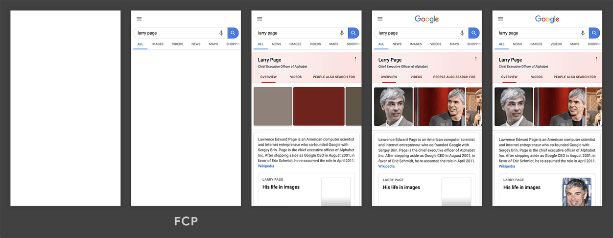

### BOM && DOM

**BOM(Browser Object Model)**

브라우저의 창이나 프레임을 프로그래밍으로 제어할 수 있게 해주는 객체 모델. 전역 객체는 `window`이며, 하위 객체로 `location`, `navigator`, `document`, `screen`, `history`가 포함된다.

**DOM(Document Object Model)**

웹 페이지를 프로그래밍으로 제어할 수 있게 해주는 객체 모델. 전역 객체는 `Node`이며, 하위 객체로는 `Document`, `Element`, `Attr`, `CharacterData` 등이 있다.

### 브라우저의 렌더링 과정

브라우저가 화면에 나타나는 요소를 렌더링할 때, **렌더링 엔진**을 사용한다. 렌더링 엔진은 HTML, CSS, Javascript를 활용하여 **CRP(Critical Rendering Path)**라는 프로세스를 거쳐 렌더링을 진행한다.

1. HTML을 파싱한 후, DOM(Document Object Model) Tree를 구축
2. CSS를 파싱한 후, CSSOM(CSS Object Model) Tree를 구축
3. Javascript(`</body>` 직전 또는 `defer` 속성을 가지는 스크립트) 실행
   - `async` 속성을 가지거나 속성이 없는 스크립트는 HTML 파싱 과정을 중단하고 실행
4. DOM Tree와 CSSOM Tree를 결합하여 Rendering Tree를 구축
   - CSS에서 `display: none;`을 가지는 엘리먼트는 제외
5. Viewport를 기반으로 Rendering Tree의 각 노드의 위치와 크기를 계산(Layout/Reflow)
6. 계산된 값을 기반으로 노드를 화면에 그림(Paint)

### 리플로우(Reflow)와 리페인트(Repaint)

**리플로우(Reflow)**

요소의 크기나 위치, Viewport의 크기 등 Layout 수치가 변경되면 그 수치에 영향을 받는 부모 및 자식 노드들도 Layout 과정을 다시 수행하면서 Rendering Tree에서 각 노드의 위치와 크기를 다시 계산하는데 이 과정을 리플로우라 한다.

리플로우가 일어나는 경우는 다음과 같다.

- 페이지 초기 렌더링 시(최초 Layout 과정)
- 윈도우 리사이징 시(Viewport 크기 변경)
- 노드 추가 또는 제거
- CSS 변경
- ETC...

**리페인트(Repaint)**

리플로우만으로는 변경사향이 실제 화면에 반영되지 않는다. 그래서 리플로우 과정에 의해 변경된 Rendering Tree를 기반으로 다시 화면을 그려주는 과정이 필요한데 이를 리페인트라 한다.

리플로우는 리페인트의 충분조건이 아니다. 대표적으로 `visibility: hidden → visible;`과 같은 속성은 리플로우를 발생시키지 않지만 리페인트를 발생시킨다.

**최적화 관점에서의 리플로우**

리플로우는 사용자의 브라우저 사용을 방해하는(User Blocking) 작업이기 때문에 최적화 관점에서 리플로우의 발생을 최소화하는 것이 중요하다.

1. 불필요한 DOM의 조작을 줄인다.
2. CSS 규칙을 최소화하고 사용되지 않는 CSS 규칙은 제거한다.
3. 애니메이션과 같이 복잡한 렌더링 변경이 필요한 경우 CRP 프로세스 밖에서 변경한다. 변경할 때 위치는 절대 위치나 고정 위치를 사용한다.
4. 불필요하고 복잡한 CSS 선택기, 특히 하위 요소 선택기를 사용하지 않는다.

### 자바스크립트 엔진에서 코드 실행 과정

브라우저는 자바스크립트 엔진을 내장하여 자바스크립트 코드를 실행한다. 브라우저마다 엔진의 종류가 달라 코드를 실행하는 방식에 다소 차이가 있을 수 있다. 다음은 일반적으로 자바스크립트 엔진의 코드 실행 과정이다.

1. 자바스크립트 소스코드는 **파서(Parser)**에 의해 **추상 구문 트리(Abstract Syntax Tree)**로 파싱된다.
2. **인터프리터(Interpreter)**가 추상 구문 트리를 기반으로 **바이트코드(Bytecode)**를 생성한다.
3. **최적화 컴파일러(Optimizing Compiler)**는 인터프리터로부터 자주 사용되는 함수 및 타입 정보 등으로 구성된 **프로파일링 데이터(Profiling Data)**를 받는다.
4. 최적화 컴파일러는 프로파일링 데이터를 기반으로 **최적화 코드(Optimized Code)**를 생성한다.
5. 프로파일링 데이터가 수정되면 최적화 코드의 최적화를 **해제(Deoptimize)**하고 다시 바이트코드를 실행해서 2~4의 작업을 반복한다.

### CSS 선택자의 우선순위

CSS 선택자의 특정성은 쉼표로 구분된 네 개의 값(`a, b, c, d`)을 기준으로 다음 규칙에 따라 계산된다.

- `a`는 인라인 스타일 사용 여부다. 속성의 선언이 요소의 인라인 스타일이라면 1, 아니면 0이다.
- `b`는 Id 선택자의 개수다.
- `c`는 클래스, 속성, 가상 클래스 선택자의 개수다.
- `d`는 태그, 가상 요소 선택자의 개수다.

특정성은 왼쪽에서 오른쪽 순으로 순서와 값을 비교하여 결정된다. 예를 들어, `0, 1, 0, 0`과 `0, 0, 10, 0` 두 선택자에 대해 전자의 특정성이 후자보다 크다.

### 웹 최적화

구글 개발자 도구중 웹페이지 최적화 성능 평가 도구인 `lighthouse`는 웹 페이지의 성능을 다음과 같이 6개의 항목으로 평가한다.

- **First Contentful Paint**: 브라우저에서 DOM의 콘텐츠의 첫 번째 bit를 렌더링하기까지의 시간
  
- **Time to Interactive**: FCP 이후에 주요 하위 리소스들이 로드되고 사용자로부터 입력을 받아 안정적으로 응답할 수 있는 시점까지의 시간
  
- **Speed Index**: 페이지 로드 중에 콘텐츠가 시각적으로 표시되기까지 걸리는 시간
- **Total Blocking Time**: FCP와 TTI 사이에서 메인 스레드가 50ms 이상 실행되는 긴 작업에 의해 메인 스레드가 입력 응답을 막을 만큼 차단된 시간의 총합
  
  
- **Largest Contentful Paint**: 페이지가 처음 로드된 시점을 기준으로 뷰포트(viewport) 내에 있는 가장 큰 이미지 또는 텍스트 블록의 렌더링 시간
- **Cumulative Layout Shift**: 페이지의 전체 수명 동안 발생하는 모든 예기치 않은 레이아웃 이동에 대해 가장 큰 레이아웃 이동 점수 버스트

### 출처

- [프론트엔드 면접 핸드북](https://frontendinterviewhandbook.com/kr/html-questions)
- [취준생이 반드시 알아야 할 프론트엔드 지식들](https://github.com/baeharam/Must-Know-About-Frontend)
- [리플로우 & 리페인트](https://boxfoxs.tistory.com/408)
- [리플로우 최소화](https://developers.google.com/speed/docs/insights/browser-reflow)
- [web.dev - FCP](https://web.dev/i18n/ko/fcp/)
- [web.dev - TTI](https://web.dev/i18n/ko/tti/)
- [web.dev - SI](https://web.dev/speed-index/)
- [web.dev - TTI](https://web.dev/i18n/ko/tbt/)
- [web.dev - LCP](https://web.dev/i18n/ko/lcp/)
- [web.dev - CLS](https://web.dev/i18n/ko/cls/)
